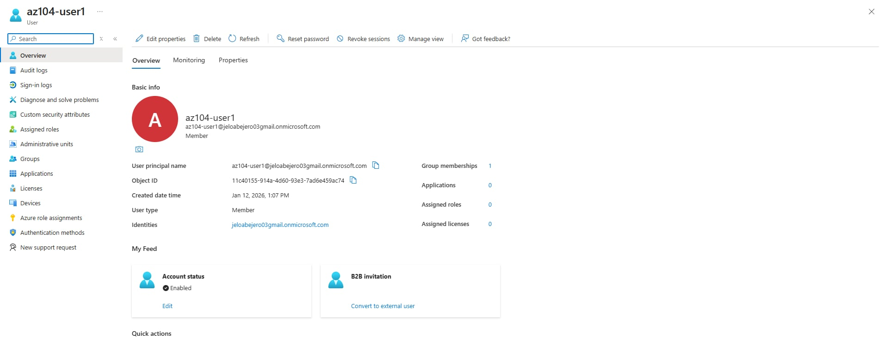
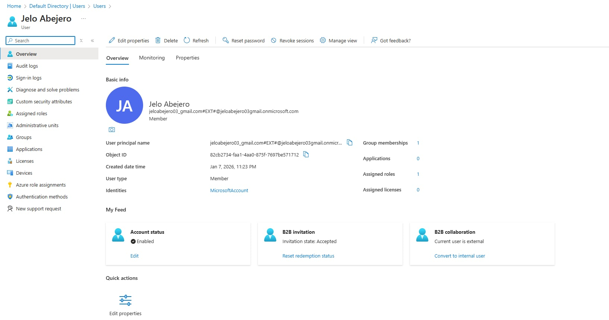
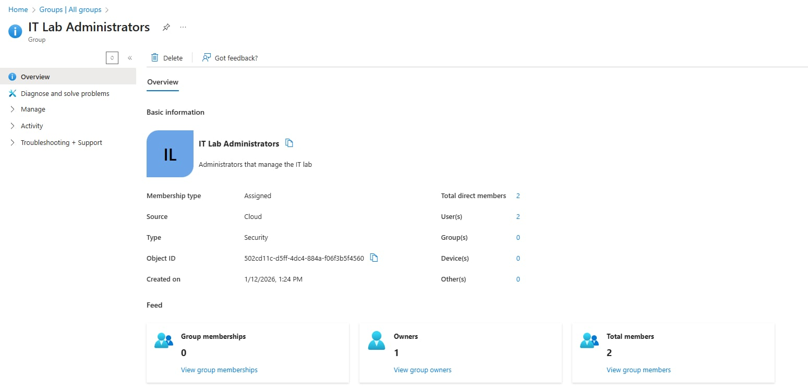

# Lab 01: Manage Microsoft Entra ID Identities

## Objective
To create and manage user and group identities in Microsoft Entra ID, demonstrating foundational identity and access management skills used in Azure environments.

This lab focuses on provisioning users, inviting external users, and managing group membership to support secure access to cloud resources.

---

## Scenario
A pre-production Azure lab environment is being prepared for engineers who will manage virtual machines and services.  
To enable authentication and access control, user accounts and groups must be created in Microsoft Entra ID, with group membership reflecting job roles.

---

## Azure Services Used
- Microsoft Entra ID (Azure Active Directory)
- Entra ID Users
- Entra ID Groups

---

## Tasks Performed

### Task 1: Create and Configure User Accounts

#### Steps
1. Signed in to the **Azure Portal**
2. Navigated to **Microsoft Entra ID**
3. Created a new internal user with the following properties:
   - User principal name: `az104-user1`
   - Job title: IT Lab Administrator
   - Department: IT
   - Usage location: United States
4. Enabled auto-generated password and confirmed account creation
5. Verified the user appeared in the Entra ID user list

### User Account Created

---

### Task 2: Invite an External (Guest) User

#### Steps
1. Selected **Invite external user** in Microsoft Entra ID
2. Sent an invitation email with a custom welcome message
3. Assigned job title, department, and usage location
4. Verified the guest user was created successfully

### Guest User Invited

---

### Task 3: Create a Security Group and Assign Members

#### Steps
1. Navigated to **Microsoft Entra ID → Groups**
2. Created a **Security group** named:
   - **IT Lab Administrators**
3. Configured group settings:
   - Membership type: Assigned
   - Owner: Current user
4. Added the following members:
   - az104-user1
   - Invited guest user
5. Verified group creation, members, and owner configuration

 ### Security Group Members

---

## Validation
- Internal and guest users successfully created
- Security group created with correct ownership
- Users correctly assigned to the group
- Configuration verified in the Azure Portal

---

## Security & Identity Concepts Learned
- Tenant-based identity management in Microsoft Entra ID
- Difference between internal and guest user accounts
- Role of security groups in access management
- Static vs dynamic group membership
- Importance of least-privilege identity design

---

## Key Takeaways
- Microsoft Entra ID is the foundation of identity and access management in Azure
- Users can be internal or external depending on access needs
- Security groups simplify access control across Azure resources
- Group membership can be managed manually or dynamically based on user attributes

---

## Notes
Dynamic group membership requires Microsoft Entra ID Premium (P1/P2).  
This lab used **assigned membership**, which is commonly available in free subscriptions.

