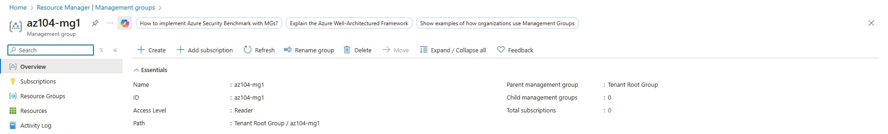

# Lab 02a: Manage Subscriptions and RBAC

## Objective
To implement **role-based access control (RBAC)** at scale by using **management groups**, assigning built-in roles, creating a **custom RBAC role**, and monitoring role assignments through Azure Activity Logs.

This lab demonstrates how Azure administrators enforce **least privilege access** across multiple subscriptions.

---

## Scenario
An organization is setting up a centralized Azure environment with multiple subscriptions.  
To simplify access management, permissions must be assigned at a higher scope while ensuring that support staff can only perform specific actions, such as managing virtual machines and creating support requests.

---

## Azure Services Used
- Management Groups
- Azure Role-Based Access Control (RBAC)
- Microsoft Entra ID
- Azure Activity Log

---

## Tasks Performed

### Task 1: Implement Management Groups

#### Steps
1. Signed in to the **Azure Portal**
2. Navigated to **Management groups**
3. Created a new management group with:
   - Management Group ID: `az104-mg1`
   - Display name: `az104-mg1`
4. Verified the management group appeared in the hierarchy

 ### Virtual Machine Contributor Role Assigned

---

### Task 2: Review and Assign a Built-in Azure Role

#### Steps
1. Opened the **az104-mg1** management group
2. Navigated to **Access control (IAM)**
3. Reviewed available built-in roles
4. Assigned the **Virtual Machine Contributor** role to a Help Desk group
5. Verified the role assignment under **Role assignments**

 ### Virtual Machine Contributor Role Assigned

---

### Task 3: Create a Custom RBAC Role

#### Steps
1. Navigated to **Access control (IAM)** for the management group
2. Selected **Add custom role**
3. Created a custom role:
   - Name: Custom Support Request
   - Description: Custom contributor role for support requests
4. Cloned the **Support Request Contributor** role
5. Removed permission to register the Microsoft.Support resource provider
6. Scoped the role to the management group
7. Reviewed and created the custom role

---

### Task 4: Monitor Role Assignments with Activity Log

#### Steps
1. Opened **Activity Log** for the management group
2. Filtered activities related to role assignments
3. Reviewed logs showing RBAC changes

### Role Assignment Activity Log

---

## Validation
- Management group successfully created
- Built-in role assigned at the management group scope
- Custom RBAC role created with restricted permissions
- Role assignment events visible in Activity Log

---

## Security & Access Control Concepts Learned
- Management groups provide centralized access control
- RBAC assignments inherit down the resource hierarchy
- Built-in roles vs custom roles
- Least privilege implementation using NotActions
- Monitoring access changes using Activity Logs

---

## Key Takeaways
- Management groups simplify access management across subscriptions
- Azure RBAC uses roles defined by Actions, NotActions, and AssignableScopes
- Custom roles help enforce least privilege when built-in roles are too broad
- Activity Logs provide visibility into permission changes

---

## Cleanup (Optional)
To avoid unnecessary resources, the management group can be removed after completing the lab.

---

