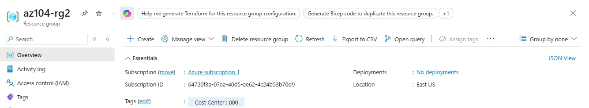
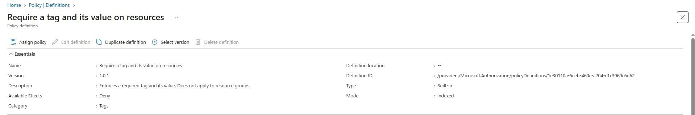
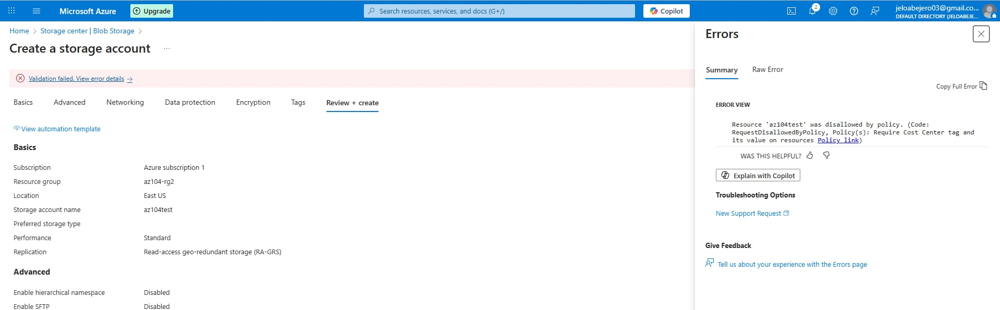
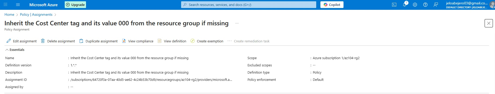
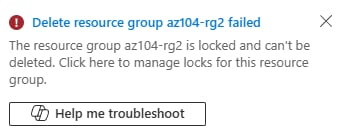

# Lab 02b – Manage Governance via Azure Policy

## Objective
To implement governance controls in Azure using resource tags, Azure Policy, and resource locks to enforce organizational standards and protect resources.

---

## Scenario
Your organization’s cloud footprint has grown considerably in the last year. During a recent audit, you discovered a substantial number of resources that do not have a defined owner, project, or cost center. In order to improve management of Azure resources in your organization, you decide to implement the following functionality:

- apply resource tags to attach important metadata to Azure resources

- enforce the use of resource tags for new resources by using Azure policy

- update existing resources with resource tags

- use resource locks to protect configured resources
  
---

## Tools & Services Used
- Azure Resource Groups  
- Azure Policy  
- Azure Tags  
- Azure Resource Locks  

---

## Tasks Performed

### 1. Created and Tagged a Resource Group
- Created a resource group named `az104-rg2` in East US
- Applied a resource tag for governance:
  - **Cost Center:** 000
- Used tags to attach metadata for ownership and cost tracking

  ### Screenshot

---

### 2. Enforced Tagging Using Azure Policy
- Assigned the built-in policy **Require a tag and its value on resources**
- Scoped the policy to the `az104-rg2` resource group
- Configured the policy to deny resource creation without the required tag
- Verified enforcement by attempting to deploy a Storage Account without tags
- Deployment was blocked due to policy non-compliance

  ### Screenshot

---

### 3. Applied Tag Inheritance Using Azure Policy
- Removed the deny-based policy assignment
- Assigned the policy **Inherit a tag from the resource group if missing**
- Enabled remediation using a managed identity
- Created a new Storage Account without manually adding tags
- Confirmed the resource automatically inherited the `Cost Center` tag from the resource group

   ### Screenshot

---

### 4. Configured and Tested Resource Locks
- Added a **Delete** lock to the resource group
- Attempted to delete the locked resource group
- Deletion was denied, confirming lock enforcement
- Removed the lock to allow cleanup

 ### Screenshot

---

## Outcome
- Enforced governance standards across Azure resources
- Ensured consistent tagging for cost and ownership tracking
- Automatically remediated non-compliant resources
- Protected resources from accidental deletion

---

## Key Concepts Learned
- Azure tagging strategies for governance
- Azure Policy deny vs modify effects
- Policy remediation and compliance enforcement
- Resource locks as post-deployment protection
- Difference between Azure Policy (pre-deployment) and RBAC/Locks (post-deployment)

---

