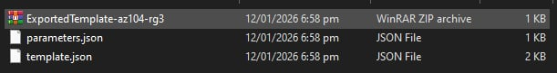
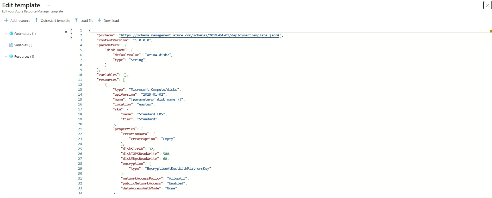
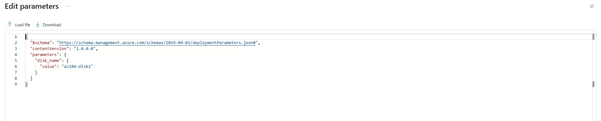
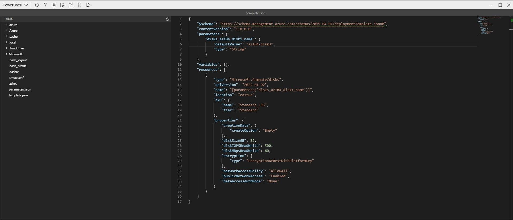
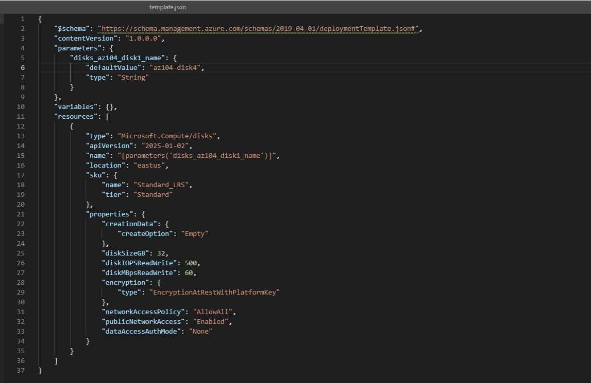
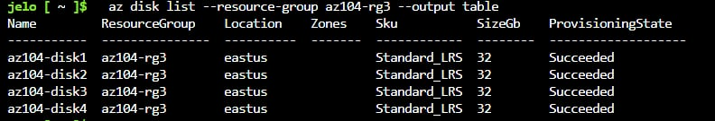
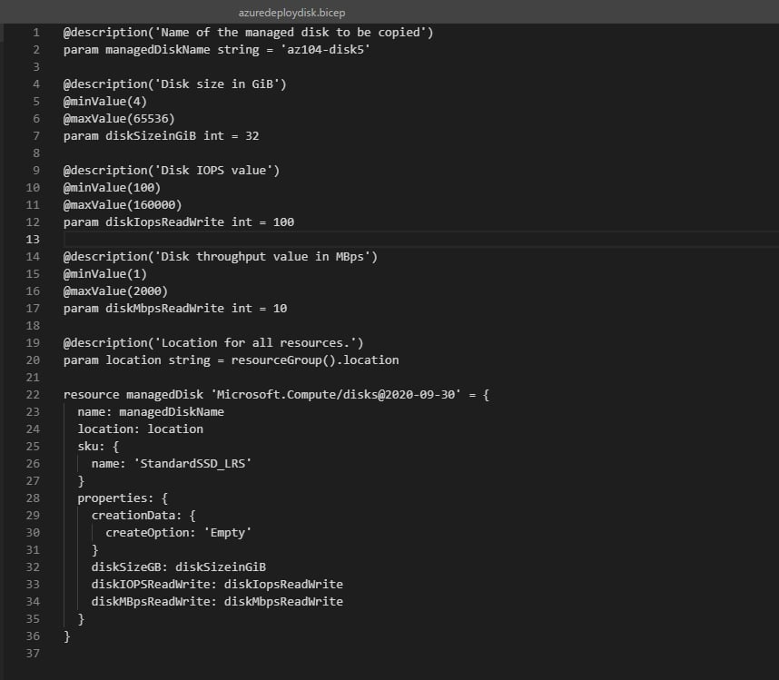

# Lab 03 – Manage Azure Resources Using ARM Templates

## Objective
To automate and standardize Azure resource deployments using Infrastructure as Code (IaC) with Azure Resource Manager (ARM) templates and Azure Bicep, reducing manual effort and configuration errors.

---

## Scenario
Your team wants to look at ways to automate and simplify resource deployments. Your organization is looking for ways to reduce administrative overhead, reduce human error and increase consistency.

---

## Tools & Services Used
- Azure Resource Manager (ARM) Templates (JSON)
- Azure Bicep
- Azure Cloud Shell
- Azure PowerShell
- Azure CLI
- Managed Disks

---

## Tasks Performed

### 1. Created a Resource and Exported an ARM Template
- Created a managed disk named `az104-disk1` in the resource group `az104-rg3`
- Configured disk settings:
  - Region: East US
  - Performance: Standard HDD
  - Size: 32 GiB
- Exported the deployed disk as an ARM template
- Reviewed the generated `template.json` and `parameters.json` files
- Downloaded and extracted the template files for reuse

**Screenshot: Managed disk successfully created**

**Screenshot: ARM template exported**

---

### 2. Modified and Redeployed an ARM Template
- Uploaded the exported ARM template to the **Custom deployment** editor
- Modified template parameters to:
  - Rename disk parameter to `disk_name`
  - Change disk name to `az104-disk2`
- Updated the parameters file to match template changes
- Redeployed the template to the same resource group
- Verified that a second managed disk was successfully created
- Reviewed deployment history and inputs in the resource group

**Screenshot: Edited template file**

**Screenshot: Updated parameters file to match template changes**

---

### 3. Deployed ARM Template Using Azure PowerShell
- Configured Azure Cloud Shell with PowerShell
- Mounted a Cloud Shell storage account
- Uploaded ARM template and parameters files
- Edited the template to deploy `az104-disk3`
- Deployed the template using PowerShell:
- Verified successful deployment and disk creation

**Screenshot: Edited the Template Using Powershell**

**Screenshot: Deployed the Template Using Powershell**

---

### 4. Deployed ARM Template Using Azure CLI
- Switched Cloud Shell to Bash
- Edited the ARM template to deploy `az104-disk4`
- Deployed the template using Azure CLI:

- Verified deployment success and confirmed disk creation using CLI commands

**Screenshot: Edited the Template Using Bash**

**Screenshot: Deployed the Template Using Bash**

---

### 5. Deployed Resources Using Azure Bicep
- Uploaded a Bicep template to Cloud Shell
- Reviewed declarative Bicep syntax for managed disk deployment
- Modified Bicep file to:
- Deploy disk `az104-disk5`
- Use `StandardSSD_LRS` SKU
- Set disk size to 32 GiB
- Deployed the Bicep template using Azure CLI
- Confirmed disk deployment in the resource group

**Screenshot: Edited the Template Using Bicep**

**Screenshot: Deployed the Template Using Bicep**

---

## Outcome
- Successfully deployed Azure resources using multiple automation methods
- Demonstrated repeatable, consistent deployments using IaC
- Reduced manual configuration through template reuse
- Deployed five managed disks using different deployment approaches

---

## Key Concepts Learned
- Infrastructure as Code (IaC) principles
- ARM template structure and parameterization
- Template deployment via Portal, PowerShell, and CLI
- Azure Cloud Shell usage and file management
- Azure Bicep as a modern alternative to ARM JSON
- Benefits of automation for consistency and error reduction

---
