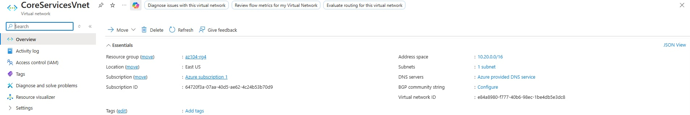
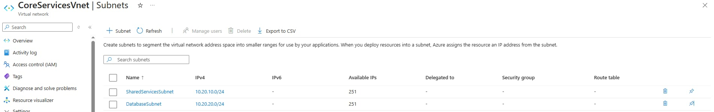
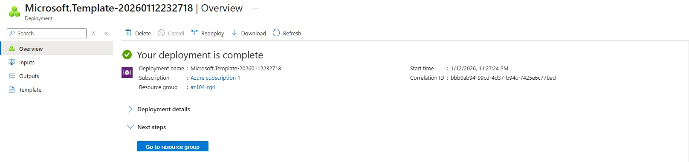
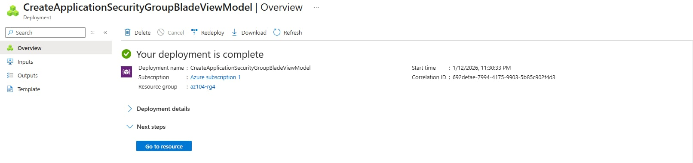
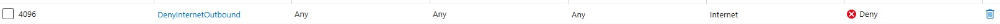
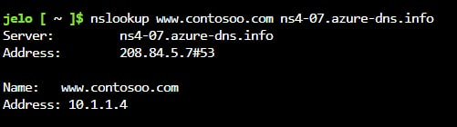
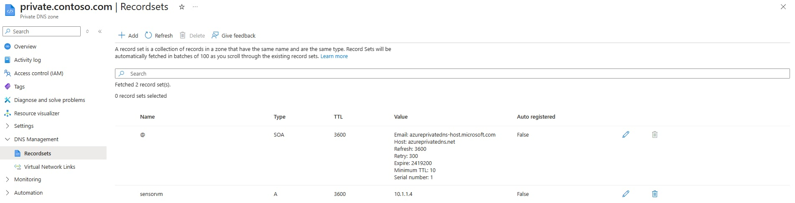

# Lab 03 – Manage Azure Resources Using ARM Templates

---

## Overview
This lab focuses on foundational Azure virtual networking concepts, including virtual networks, subnet design, network security groups (NSGs), application security groups (ASGs), and Azure DNS. The lab demonstrates how to design scalable network address spaces, enforce traffic control, and implement name resolution for both public and private resources.

Services used: Azure Virtual Network, ARM Templates, Network Security Groups, Application Security Groups, Azure DNS
Region: East US

---

## Objective
- Design and deploy virtual networks with scalable IP addressing
- Automate virtual network deployment using ARM templates
- Control network traffic using NSGs and ASGs
- Configure public and private DNS zones in Azure

---

## Scenario
Your global organization plans to implement virtual networks. The immediate goal is to accommodate all the existing resources. However, the organization is in a growth phase and wants to ensure there is additional capacity for the growth.

---

## Tasks Performed

### 1. Created Virtual Network and Subnets Using Azure Portal
- Created a virtual network named `CoreServicesVnet`
- Assigned address space `10.20.0.0/16` to allow future growth
- Created the following subnets:
  - `SharedServicesSubnet` → `10.20.10.0/24`
  - `DatabaseSubnet` → `10.20.20.0/24`
- Removed the default subnet to align with network design best practices
- Verified address space and subnet configuration after deployment
- Exported the deployed virtual network as an ARM template for reuse

#### Validation

**CoreServicesVnet successfully deployed**

**Subnet configuration**

  
---

### 2. Deployed a Virtual Network Using an ARM Template
- Modified the exported ARM template to deploy a second virtual network:
  -Renamed virtual network to `ManufacturingVnet`
  - Updated address space to `10.30.0.0/16`

- Created manufacturing subnets sized for projected growth:
  - SensorSubnet1 → `10.30.20.0/24`
  - SensorSubnet2 → `10.30.21.0/24`

- Updated the parameters file to reflect the new virtual network name
- Deployed the template using Custom Deployment
- Verified successful creation of the virtual network and subnets

#### Validation

**ManufacturingVnet deployed using ARM template**

  

---

### 3. Configured Communication Using ASG and NSG
- Created an Application Security Group named `asg-web`
- Created a Network Security Group named `myNSGSecure`
- Associated the NSG with the `SharedServicesSubnet` in `CoreServicesVnet`
- Configured inbound NSG rule:
  - Allowed TCP traffic on ports 80 and 443
  - Source restricted to `asg-web`
- Configured outbound NSG rule:
  - Explicitly denied all outbound internet traffic
  - Used Service Tag: Internet
- Validated rule priority and traffic flow logic

#### Validation

**Application Security Group**

**NSG inbound rule allowing ASG traffic**

**NSG outbound rule denying internet access**

  ---

### 4. Configured Public and Private Azure DNS Zones
reated a public DNS zone named contoso.com
- Added an A record:
  - Host: `www`
  - IP address: `10.1.1.4`
- Verified public DNS resolution using `nslookup`
- Created a private DNS zone named `private.contoso.com`
- Linked the private DNS zone to `ManufacturingVnet`
- Added a private A record:
  - Host: `sensorvm`
  - IP address: `10.1.1.4`
- Confirmed private DNS zone configuration and virtual network linkage

#### Validation

**Public DNS zone and A record**

**Private DNS zone linked to ManufacturingVnet**

  

---

### 4. Key Takeaways
- Azure Virtual Networks provide isolated, scalable networking in the cloud
- Proper IP address planning prevents overlap and simplifies troubleshooting
- Subnets enable logical separation and security segmentation within a VNet
- Network Security Groups control inbound and outbound traffic using rules
- Application Security Groups simplify rule management by grouping workloads
- Azure DNS supports both public and private name resolution scenarios
- ARM templates enable consistent, repeatable network deployments
