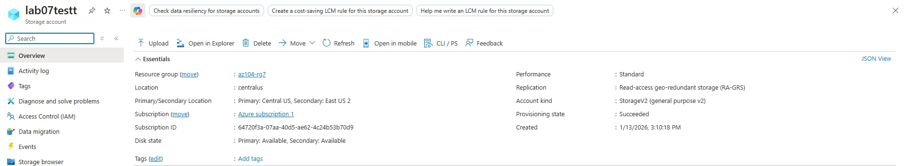
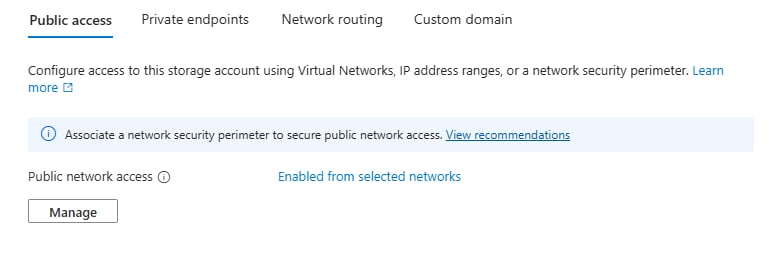
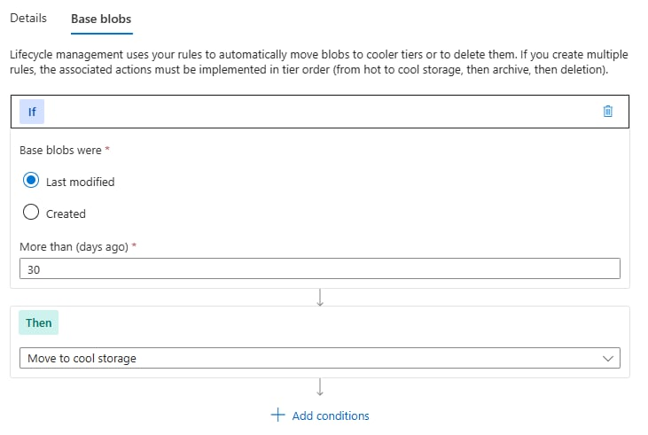
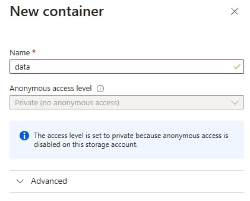
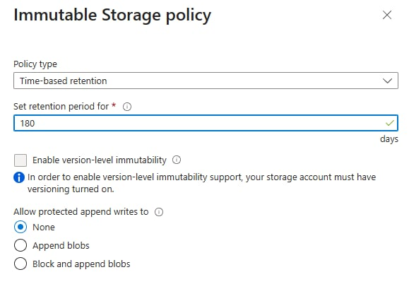
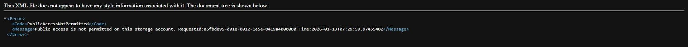
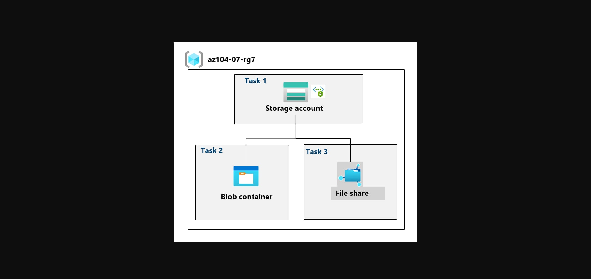
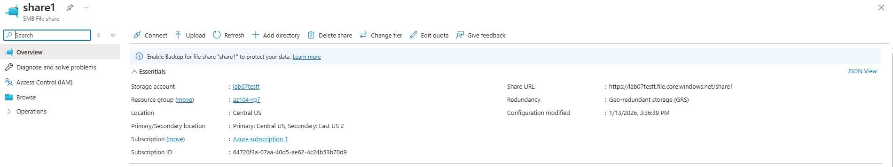
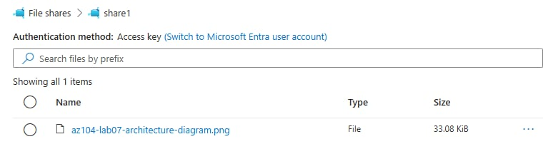

# Lab 07 – Manage Azure Storage (AZ-104)

## Overview
This lab focuses on deploying and securing Azure Storage services. The objectives include configuring storage accounts, securing blob containers, implementing lifecycle management, using Shared Access Signatures (SAS), and managing Azure File Shares with network restrictions.

---

## Scenario
Your organization is currently storing data in on-premises data stores. Most of these files are not accessed frequently. You would like to minimize the cost of storage by placing infrequently accessed files in lower-priced storage tiers. You also plan to explore different protection mechanisms that Azure Storage offers, including network access, authentication, authorization, and replication. Finally, you want to determine to what extent Azure Files is suitable for hosting your on-premises file shares.

Architecture diagram

---

## Objectives
- Create and configure a secure Azure Storage Account
- Implement blob storage with lifecycle management and immutability
- Secure blob access using Shared Access Signatures (SAS)
- Create and manage Azure File Shares using Storage Browser
- Restrict storage access using virtual network service endpoints

---

## Task 1: Create and Configure a Storage Account

### Storage Account Configuration
- **Resource Group:** az104-rg7
- **Storage Account Type:** Standard
- **Redundancy:** Geo-redundant storage (GRS)
- **Read-access geo-redundant storage (RA-GRS):** Enabled
- **Public Network Access:** Disabled initially
- **Encryption:** Microsoft-managed keys (default)

### Storage Account Overview

### Network Security Configuration
- Enabled public network access from **selected networks only**
- Added client IPv4 address temporarily
- Verified access control via Networking settings

### Network Access Restricted to Selected Networks

### Lifecycle Management
- Created a lifecycle rule named **Movetocool**
- Condition:  
  - Move blobs to **Cool** tier if not modified for **30 days**
- Purpose: Optimize storage cost for infrequently accessed data

### Lifecycle Management Rule – Move to Cool Tier

---

## Task 2: Create and Secure Azure Blob Storage

### Blob Container Creation
- **Container name:** data
- **Public access level:** Private (no anonymous access)

  ### Private Blob Container

### Immutable Blob Storage
- Enabled **Time-based retention policy**
- Retention period: **180 days**
- Purpose: Ensure data cannot be modified or deleted during retention period

### Immutable Blob Storage Policy

### Blob Upload Configuration
- Uploaded a test file with the following settings:
  - **Blob type:** Block blob
  - **Access tier:** Hot
  - **Upload folder:** securitytest
  - **Encryption scope:** Default container scope

### Access Validation
- Direct URL access resulted in **PublicAccessNotPermitted**
- Confirmed container privacy enforcement

### Secure Blob Access via SAS

### Secure Access with SAS
- Generated a **Read-only SAS token**
- Configured with limited validity window
- Verified access using SAS URL in InPrivate browser

### Secure Blob Access via SAS

---

## Task 3: Create and Configure Azure File Storage

### File Share Configuration
- **File share name:** share1
- **Access tier:** Transaction optimized
- **Backup:** Disabled (lab simplification)

### Azure File Share Created

### Storage Browser Usage
- Used Azure Storage Browser to:
  - Create directories
  - Upload files
  - Browse file share content

### Storage Browser File Upload

### Network Access Restriction
- Created a virtual network:
  - **VNet name:** vnet1
  - **Subnet:** Default
- Enabled **Microsoft.Storage** service endpoint on subnet
- Allowed access only from **vnet1**
- Removed client IP access

### Access Verification
- Storage Browser access from local machine resulted in:
  - **Authorization failure**
- Confirmed network-based access control enforcement

### Storage Browser File Upload

---

## Security Highlights
- Private blob containers (no public access)
- Immutable blob storage (WORM)
- SAS-based least-privilege access
- Virtual network service endpoint restriction
- Geo-redundant storage for high availability

---

## Key Takeaways
- Azure Storage supports strong security controls at the network and data level
- Lifecycle management reduces storage costs automatically
- SAS tokens provide granular, time-bound access
- Azure Files can replace or extend on-prem file shares
- Service endpoints restrict storage access to trusted virtual networks

---

## Cleanup
To avoid unnecessary charges:
- Deleted resource group **az104-rg7**

---

## Skills Demonstrated
- Azure Storage Account configuration
- Blob storage security and lifecycle management
- Shared Access Signature (SAS) implementation
- Azure File Shares and Storage Browser
- Network-restricted storage access
- AZ-104 storage administration fundamentals
