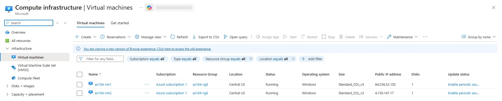
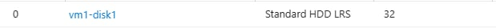
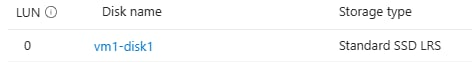
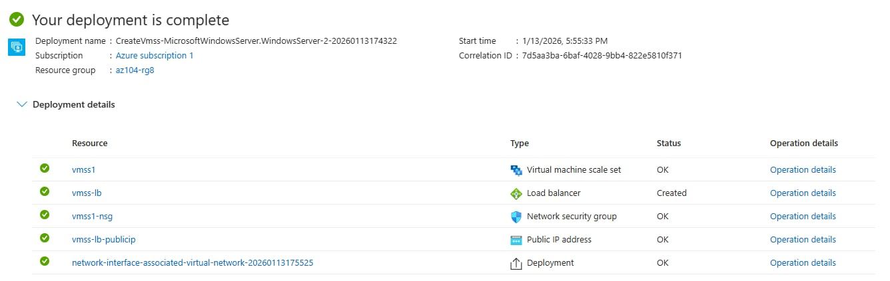
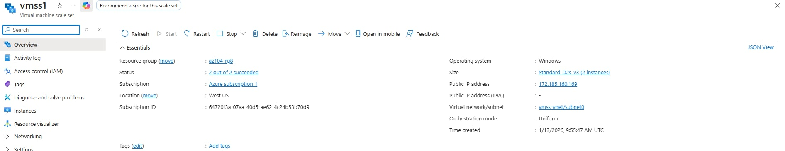
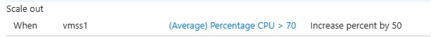
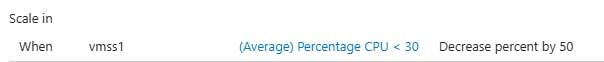
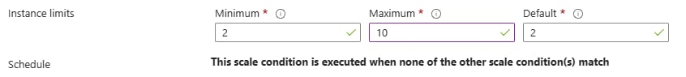

# Lab 08 – Manage Virtual Machines

## Lab Introduction
In this lab, you create and compare Azure Virtual Machines and Virtual Machine Scale Sets. You deploy zone-resilient virtual machines, scale compute and storage resources, and configure autoscaling using Virtual Machine Scale Sets.

---

## Lab Scenario
Your organization wants to explore deploying and configuring Azure Virtual Machines. First, you deploy Azure virtual machines with manual scaling. Next, you deploy a Virtual Machine Scale Set (VMSS) and configure autoscaling based on CPU utilization.

---

## Job Skills
- Deploy zone-resilient Azure virtual machines
- Scale virtual machine compute and storage
- Create and configure Virtual Machine Scale Sets
- Implement autoscaling rules
- Use Azure PowerShell and Azure CLI for VM management

---

## Task 1: Deploy Zone-Resilient Azure Virtual Machines

Two Windows Server virtual machines were deployed across different availability zones to achieve a 99.99% uptime SLA.

### Configuration Summary

- Resource group: az104-rg8
- Virtual machines: az104-vm1, az104-vm2
- Region: East US
- Availability zones: Zone 1 and Zone 2
- Image: Windows Server 2025 Datacenter (Gen2)
- Size: Standard D2s v3 (or nearest available)
- Public inbound ports: None
- OS disk: Premium SSD
- Boot diagnostics: Disabled

> Availability zones ensure higher resiliency by distributing VMs across physically separate datacenters.

## Deployed Zone-Resilient Azure Virtual Machines


---

## Task 2: Manage Compute and Storage Scaling

### Resize Virtual Machine

The virtual machine **az104-vm1** was resized to demonstrate vertical scaling.

- Original size: Standard D2s v3
- New size: D2ds v4 (or available alternative)

## Resized Virtual Machine 1


### Manage Data Disks

A data disk was added, detached, resized, and reattached.

- Disk name: vm1-disk1
- Initial type: Standard HDD (32 GiB)
- Updated type: Standard SSD

This demonstrates flexible storage scaling independent of the virtual machine.

## Data disk attached: vm1-disk1


## Disk performance updated: SSD


---

## Task 3: Create and Configure Azure Virtual Machine Scale Sets

A Virtual Machine Scale Set was deployed to enable automated horizontal scaling.

### VM Scale Set Configuration

- Name: vmss1
- Resource group: az104-rg8
- Availability zones: Zones 1, 2, 3
- Orchestration mode: Uniform
- Image: Windows Server 2025 Datacenter
- VM size: Standard D2s v3

### Networking and Security

- Custom virtual network and subnet created
- Network Security Group allows HTTP (port 80)
- Azure Load Balancer with public IP configured

## Created and Configured Azure Virtual Machine Scale Sets





---

## Task 4: Scale Azure Virtual Machine Scale Sets

Autoscaling rules were configured based on CPU utilization.

### Scale-Out Rule

- Trigger: Average CPU > 70% for 10 minutes
- Action: Increase instance count by 50%
- Cooldown: 5 minutes



### Scale-In Rule

- Trigger: Average CPU < 30% for 10 minutes
- Action: Decrease instance count by 50%



### Instance Limits

- Minimum instances: 2
- Maximum instances: 10
- Default instances: 2



---

## Task 5: Create a Virtual Machine Using Azure PowerShell (Optional)

```powershell
New-AzVm `
 -ResourceGroupName 'az104-rg8' `
 -Name 'myPSVM' `
 -Location 'East US' `
 -Image 'Win2019Datacenter' `
 -Zone '1' `
 -Size 'Standard_D2s_v3' `
 -Credential (Get-Credential)
```
`Get-AzVM -ResourceGroupName 'az104-rg8' -Status`
`Stop-AzVM -ResourceGroupName 'az104-rg8' -Name 'myPSVM'`


## Task 6: Create a Virtual Machine Using Azure CLI (Optional)

```bash
az vm create \
  --name myCLIVM \
  --resource-group az104-rg8 \
  --image Ubuntu2204 \
  --admin-username localadmin \
  --generate-ssh-keys

az vm show \
  --name myCLIVM \
  --resource-group az104-rg8 \
  --show-details \
  --output table

az vm deallocate \
  --resource-group az104-rg8 \
  --name myCLIVM
```

---

### Key Takeaways
- Azure Virtual Machines support high availability using availability zones
- Virtual machines can be vertically scaled by resizing compute resources
- Storage performance and size can be modified independently
- Virtual Machine Scale Sets enable automated horizontal scaling
- Autoscaling improves availability and cost efficiency

---
