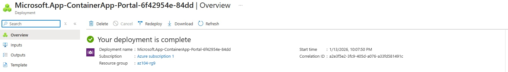
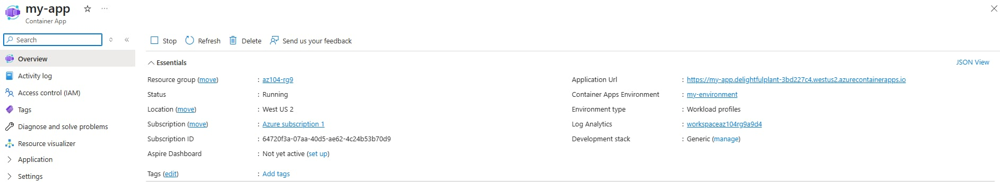
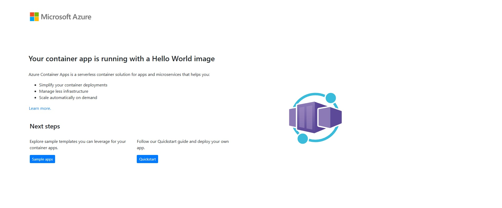

# Lab 09c – Implement Azure Container Apps

## Lab Introduction
In this lab, you learn how to deploy and test Azure Container Apps (ACA). Azure Container Apps is a serverless container platform built on Kubernetes that abstracts cluster management while providing scaling, networking, and deployment features.

---

## Lab Scenario
Your organization has a web application running on a virtual machine in an on-premises data center. The organization wants to migrate applications to the cloud while minimizing infrastructure management. Azure Container Apps is evaluated as a managed, serverless container platform.

---

## Job Skills
- Create and configure an Azure Container App
- Create and manage a Container Apps environment
- Verify container app deployment and accessibility

---

## Task 1: Create and Configure an Azure Container App and Environment

Azure Container Apps simplifies container orchestration by managing the Kubernetes environment and related infrastructure.

### Container App Configuration

- Resource group: az104-rg9
- Container app name: my-app
- Region: East US
- Container Apps environment: my-environment (new)

### Container Image Settings

- Image type: Quickstart image
- Image: Simple hello world container
- Ingress: Enabled
- Target port: 80

The container app and environment were reviewed and successfully created.

> Deployment may take a few minutes while the environment is provisioned.

## Deployed an an Azure Container App and Environment

---

## Task 2: Test and Verify Deployment of the Azure Container App

After deployment completed, the container app was validated.

### Verification Steps

- Navigated to the container app resource
- Copied the **Application URL** provided by Azure Container Apps
- Opened the URL in a web browser

The following message was displayed:
`Your Azure Container Apps app is live`

## Deployed an an Azure Container App and Environment

This confirms the container app is running and accessible via the public endpoint.

---

## Key Takeaways
- Azure Container Apps (ACA) is a serverless container platform built on Kubernetes
- ACA abstracts Kubernetes cluster management and infrastructure
- Container Apps automatically provide ingress, scaling, and networking
- ACA is well-suited for long-running web applications and APIs
- Less operational overhead compared to Azure Kubernetes Service (AKS)

