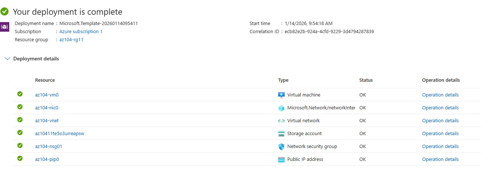
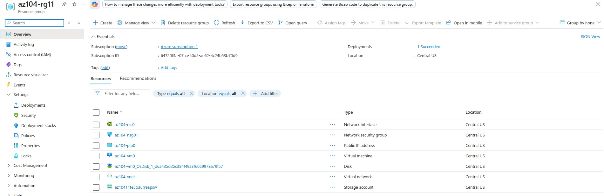
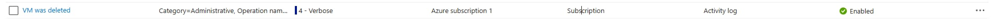
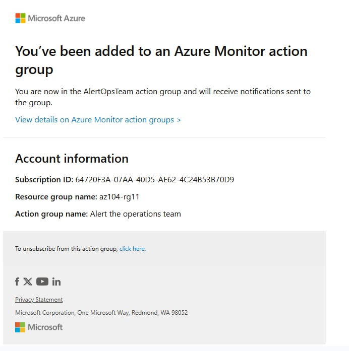
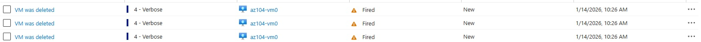
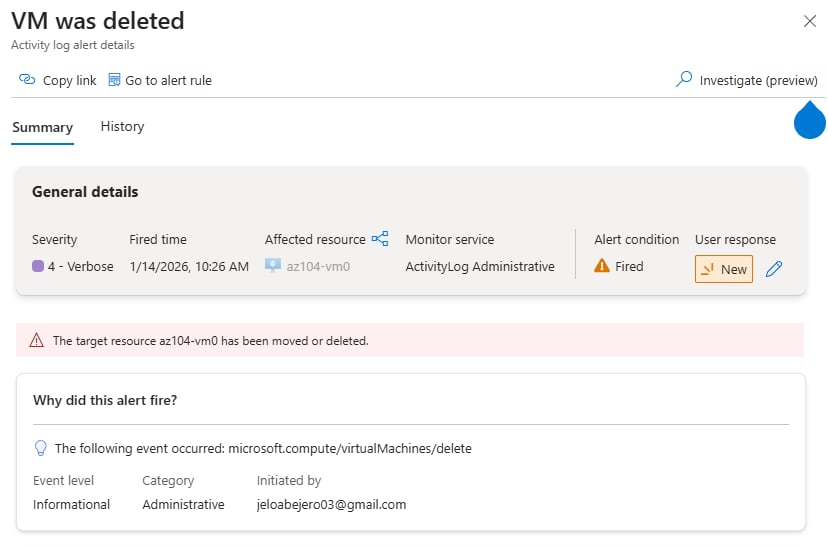
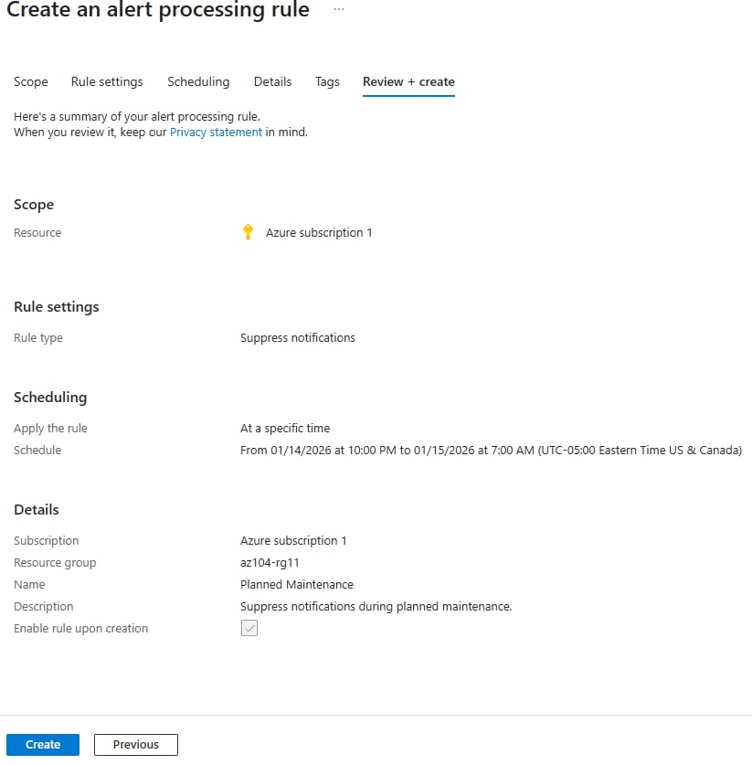
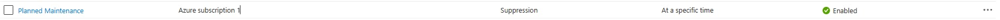

# Lab 11 – Implement Monitoring

## Lab Introduction
In this lab, you learn how to use **Azure Monitor** to track infrastructure activity, create alerts, configure action groups, suppress alerts during maintenance, and analyze logs using Log Analytics and KQL queries.


---

## Lab Scenario
Your organization has migrated its infrastructure to Azure. Administrators must be notified of significant infrastructure changes, such as virtual machine deletion. You will explore Azure Monitor capabilities including alerts, action groups, alert processing rules, and log queries.

---

## Job Skills
- Deploy infrastructure using an ARM template
- Create Azure Monitor alerts
- Configure action group notifications
- Trigger and validate alerts
- Suppress alerts using alert processing rules
- Query logs using Azure Monitor and KQL

---

## Task 1: Use a Template to Provision Infrastructure

An ARM template was used to deploy a virtual machine for monitoring and alert testing.

### Deployment Details
- Resource group: az104-rg11
- Region: East US
- Virtual machine: az104-vm0
- Username: localadmin
- Password: Complex password

### Deployed Resources
- One virtual network
- One virtual machine

The deployment completed successfully and the resources were verified in the resource group.

## Deployed a Template to Provision Infrastructure


## Template Overview


---

### Configure Azure Monitor for Virtual Machines

Azure Monitor VM Insights was enabled to collect performance metrics and logs.

Steps completed:
- Opened **Azure Monitor**
- Selected **VM Insights**
- Enabled monitoring for the deployed virtual machine
- Accepted default configuration

> Note: VM Insights agent installation may take several minutes.

---

## Task 2: Create an Alert

An alert rule was created to detect when a virtual machine is deleted.

### Alert Configuration
- Scope: Azure subscription
- Signal type: **Delete Virtual Machine (Virtual Machines)**
- Event level: All
- Status: All

This alert monitors deletion events across virtual machines in the subscription.

## Alert Rule Created



---

## Task 3: Configure Action Group Notifications

An action group was created to notify administrators via email when the alert is triggered.

### Action Group Details
- Action group name: Alert the operations team
- Display name: AlertOpsTeam
- Resource group: az104-rg11
- Region: Global

### Notification Settings
- Notification type: Email
- Notification name: VM was deleted
- Recipient: Administrator email address

An email confirmation was received confirming successful action group creation.

## Email Confirmation


---

## Task 4: Trigger an Alert and Confirm Functionality

The alert was tested by deleting the virtual machine.

### Test Steps
- Selected virtual machine: az104-vm0
- Deleted the VM using force delete
- Confirmed deletion completed successfully

### Validation
- Email notification received from Azure Monitor

## Alert Email

 
- Alert visible in **Monitor > Alerts**

## Three Verbose Alerts

  
- Alert details showed the deletion event and timestamp

## Alert Details


---

## Task 5: Configure an Alert Processing Rule

An alert processing rule was created to suppress notifications during planned maintenance.

### Rule Configuration
- Rule name: Planned Maintenance
- Resource group: az104-rg11
- Action: Suppress notifications

### Schedule
- Start time: Today at 10:00 PM
- End time: Tomorrow at 7:00 AM
- Time zone: Local time zone

## Alert Processing Rule Creation


This ensures alerts are not sent during maintenance windows.

## Alert Processing Rule


---

## Task 6: Use Azure Monitor Log Queries

Azure Monitor Logs were used to analyze collected telemetry.

### Steps Performed
- Opened **Monitor > Logs**
- Set scope to subscription
- Viewed prebuilt **Virtual machine** queries
- Ran the **Count heartbeats** query

### Custom KQL Query
The following query was executed to analyze VM CPU utilization:

```kql
InsightsMetrics
| where TimeGenerated > ago(1h)
| where Name == "UtilizationPercentage"
| summarize avg(Val) by bin(TimeGenerated, 5m), Computer
| render timechart
```
> Note: Data availability may vary depending on agent installation time.

## Key Takeaways
- Azure Monitor provides centralized monitoring for metrics, logs, and events
- Alerts help detect and respond to infrastructure changes quickly
- Action groups define how and who gets notified
- Alert processing rules suppress alerts during maintenance windows
- Log Analytics and KQL enable deep operational insights
- Alerts can be created from metrics, logs, and activity events

##Learning Extension
- Create alerts based on performance metrics
- Trigger alerts from log queries
- Integrate Azure Monitor with SIEM tools
- Explore Log Analytics demo environments

---
